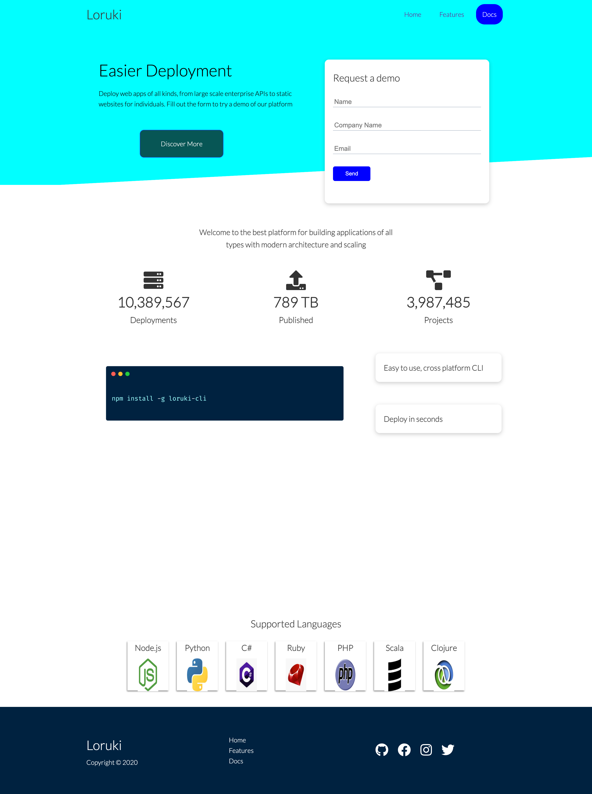

# Loruki

Is a cloud services hosting, which means you can deploy your project(s) on it ,
so everyone can see it online

## Table of contents

- [Loruki](#loruki)
  - [Table of contents](#table-of-contents)
  - [Screenshots](#screenshots)
  - [Technologies](#technologies)
  - [Setup](#setup)
  - [Inspiration](#inspiration)
  - [Contact](#contact)

## Screenshots

## Technologies

|              |                                                                                                                                                                                                         |
| ------------ | ------------------------------------------------------------------------------------------------------------------------------------------------------------------------------------------------------- |
| MarkDown     |                                                                                                    |
| Git & GitHub |   |
| VSCODE       |                                                                                                      |
| Node & npm   |       |
| HTML & CSS   |                   |

## Setup

- Create [github account](www.github.com)
- Create a
  [repository](https://github.com/HYF-Class19/agile-development-loruki-group-1)
- Clone a repository and start editing
- Create a board [project](https://github.com/orgs/HYF-Class19/projects/11)
- Create
  [issues](https://github.com/HYF-Class19/agile-development-loruki-group-1/issues)
- download vscode & install [sorce](https://code.visualstudio.com/download)
- Have a git version on your computer
- install node packages manager
  
- Edit CSS file & HTML files
- Run npm scripts:
  - `npm run format`
  - `npm run format:check`
  - `npm run lint:ls`
  - `npm run lint:md`
  - `npm run lint:css`
  - `npm run validate:html`

## Inspiration

- [w3school](https://www.w3schools.com/)
- [Stackoverflow](https://stackoverflow.com/)
- [Habr](https://habr.com/en/all/)

## Contact

| bibhasingh                                                                                                         | Elnura                                                                                                     | Galal                                                                                                    | Nashmia Burki                                                                                                | Valeriya                                                                                                       |
| ------------------------------------------------------------------------------------------------------------------ | ---------------------------------------------------------------------------------------------------------- | -------------------------------------------------------------------------------------------------------- | ------------------------------------------------------------------------------------------------------------ | -------------------------------------------------------------------------------------------------------------- |
| [GitHub](https://github.com/bibhasingh)                                                                            | [GitHub](https://github.com/Elya88)                                                                        | [GitHub](https://github.com/galalkoro98)                                                                 | [GitHub](https://github.com/nashmiab)                                                                        | [GitHub](https://github.com/V-Valkiriya)                                                                       |
|  |  |  |  |  |
