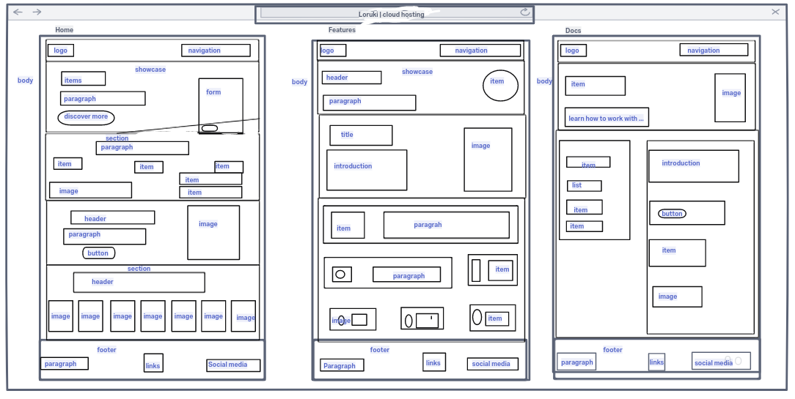

# Design

- **Means of design** To create, fashion, execute, or construct according to
  plan : devise, contrive design a system for tracking inventory.
  

Check this [source](https://galal959955.invisionapp.com/homepage) to design a
wireframe for your project
